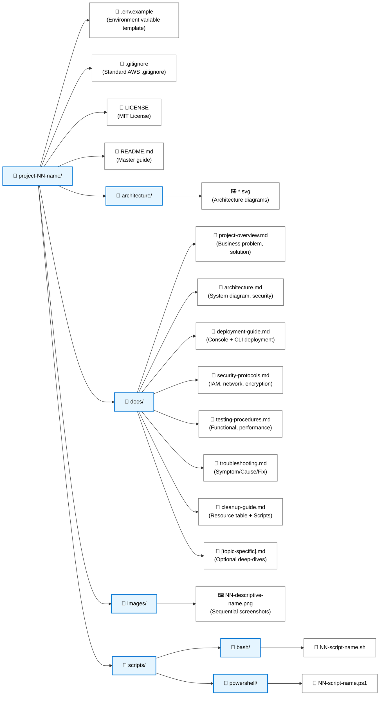

# Project Structure Template

This repository follows a strict structural template for all projects (01–14). To ensure consistency across the entire portfolio, any new projects or modifications must adhere to this standard.

## 📁 Directory Structure

## 📄 Core Document Templates

### README.md
The `README.md` is the entry point for the project and must follow this exact sequence:

1. **Header Block:** AWS logo (`width="36" height="36"`), H1 title, description, and status badges.
2. **Architecture Overview:** Embedded SVG diagram (use forward slashes for paths: `./architecture/diagram.svg`).
3. **Infrastructure Specifications:** Table detailing regions, instance types, etc.
4. **Key Components:** H3 subheadings for each major AWS service used.
5. **Core Features:** Bullet list highlighting design decisions (e.g., HA, encryption).
6. **Free Tier Status:** Mandatory table outlining the cost of each resource used.
7. **Setup & Installation:** Prerequisites, Pre-flight Checks (PowerShell), Installation (`cp .env.example .env`), and the Run Commands execution table.
8. **Documentation Suite:** Table linking to files in `docs/` with descriptive emojis.
9. **Contribution & Maintenance:** Testing, deployment, contributing guidelines.
10. **License:** Link explicitly to `./LICENSE` (the project-local MIT license).
11. **Footer:** Prev/Next project navigation block.

### Architecture Diagrams (`architecture/*.svg`)
All project architecture diagrams must conform to the established modern SVG design language:
- **Format:** Pure SVG (`.svg`) is mandatory. No raster images (PNG/JPG) for architectures.
- **Styling & Theme:** Use the standardized light-theme gradient backgrounds (e.g., `#F8FAFC` to `#EFF6FF`). Avoid dark themes.
- **Interactivity:** Elements must have CSS-driven hover states (e.g., `transform: scale(1.05)`, dynamic drop shadows) to provide a modern, interactive experience.
- **Animations:** Data flow and component states should be represented dynamically using CSS keyframe animations (e.g., floating instances, pulsing alerts for failure states, dashed moving lines for data flow).
- **Icons:** Use official AWS architectural icons embedded directly into the SVG to maximize visual appeal.

### Cleanup Guide (`docs/cleanup-guide.md`)
Must include the following sections:
- `> [!CAUTION]` block warning of irreversible action
- `## 📋 Resources to Delete` (Table showing resource, service, and deletion order rationale)
- `## 🖥️ Method 1: AWS Management Console` (Numbered steps)
- `## 🐧 Method 2: AWS CLI (Bash)` (Full script embedded inline)
- `## 🪟 Method 3: AWS CLI (PowerShell)` (Full script embedded inline)
- `## ✅ Cleanup Verification` (CLI commands to verify deletion)
- `## 💰 Cost Implications` (Details on what charges stop)

### Troubleshooting Guide (`docs/troubleshooting.md`)
Must use a structured approach for errors rather than just a dump of commands:
- Categorized sections (e.g., `## Network Errors`, `## Authentication Errors`)
- Under each section, list errors with: **Symptom**, **Cause**, and **Fix**.
- Provide a `## 📋 Quick Reference Table` mapping Problem to Quick Fix.
- Provide a `## 🔍 Debug Commands` section with useful CLI probing commands.

### Security Protocols (`docs/security-protocols.md`)
Must address the security posture of the deployed architecture:
- `## 🔐 IAM & Access Control` (Instance profiles, service-linked roles, resource policies)
- `## 🛡️ Network Security` (Security group chaining, VPC isolation)
- `## 🔒 Encryption` (Data at rest via KMS, data in transit via TLS)
- `## 📋 Compliance & Best Practices` (Audit logging, IMDSv2, least privilege)

## 💻 Scripting & Automation Standards

All automation scripts must be robust, user-friendly, and include proper error handling. Each project must provide both Bash (`.sh`) and PowerShell (`.ps1`) equivalents.

### Bash Guidelines
- **Strict Mode:** Always use `set -e` (exit on error) and `set -u` (treat unset variables as an error) at the top of the script.
- **Variable Assignment:** Prefer `aws [service] ... --query ... --output text` for clean variable assignment.
- **Logging:** Use explicit logging with prefixes to inform the user of progress (e.g., `echo "=> Creating VPC..."`).
- **Idempotency:** Implement cleanup scripts that suppress "does not exist" errors (e.g., `2>/dev/null`) to allow the script to be run multiple times safely.

### PowerShell Guidelines
- **Strict Mode:** Always set `$ErrorActionPreference = "Stop"` at the top of the script.
- **Suppress Noise:** Assign read-only AWS CLI command outputs to `$null = aws ...` or pipe to `| Out-Null` to suppress unwanted terminal noise and keep the console clean.
- **Logging:** Use `Write-Host` for user-facing console output, utilizing colors where appropriate to indicate success or failure.
- **Idempotency:** In cleanup scripts, append `2>$null` to deletion commands to prevent red error text when resources are already deleted.

## 🎨 Design System

When writing markdown for these projects, utilize these specific design elements:

1. **GitHub Alerts:** Use `> [!NOTE]`, `> [!TIP]`, `> [!WARNING]`, `> [!CAUTION]`, and `> [!IMPORTANT]` to highlight crucial information visually.
2. **Collapsible Sections:** Use `

Title
Content
` for verbose outputs, large JSON policies, or deep-dive asides that would otherwise clutter the main reading flow.
3. **Emoji Symbology:** Consistent use of emojis helps visual parsing.
   - 🏗️ Architecture
   - 🛠️ Setup / Configuration
   - 🧹 Cleanup
   - 🔐 Security
   - 🧪 Testing / Validation
   - ⚠️ Warnings / Cost Implications
