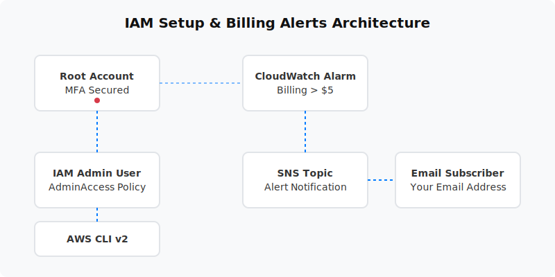

  

  # AWS Account Setup & IAM Foundations (Project 01)
  
  **A foundational project to secure a new AWS account using IAM best practices.**

---

## 📋 Project Overview
This project establishes a secure baseline for a new AWS account. It covers disabling the root user for daily use, enforcing MFA, creating a least-privilege IAM admin user, setting up AWS CLI v2 on Windows, and configuring billing alerts via CloudWatch and SNS.

- **Level:** 🟢 Beginner
- **Time to Complete:** 1-2 hours
- **Cost Estimate:** $0.00 (IAM and billing alerts are strictly free-tier)

## 🏗️ Architecture Flow
1. **Root Account:** Secured with hardware or virtual MFA.
2. **IAM Admin User:** Created with `AdministratorAccess` policy for daily administration.
3. **Programmatic Access:** AWS CLI v2 installed and configured using Access Keys.
4. **Billing Alerts:** CloudWatch Alarm set at $5 threshold → SNS Topic → Email Notification.

## 📚 Documentation
For a deep dive into the components and steps, please refer to the documents below:

- 📄 [Project Overview](docs/project-overview.md)
- 🏗️ [Architecture Details](docs/architecture.md)
- 🚀 [Deployment Guide](docs/deployment-guide.md)
- 🔐 [Security Protocols](docs/security-protocols.md)
- 🧪 [Testing Procedures](docs/testing-procedures.md)
- 🛠️ [Troubleshooting](docs/troubleshooting.md)
- 🧹 [Cleanup Guide](docs/cleanup-guide.md)

## 💻 Automation Scripts
This project contains ready-to-run automation scripts for both **PowerShell** and **Bash**.
These scripts handle programmatic setup if you choose to automate the process after the initial console configuration.

- **Windows:** `scripts/powershell/`
- **Linux/Mac:** `scripts/bash/`

## 🎓 Learning Objectives
1. Implement the Principle of Least Privilege (PoLP) by avoiding root user usage.
2. Enforce Multi-Factor Authentication (MFA) for high-level accounts.
3. Configure the AWS CLI securely on local machines.
4. Safeguard against unexpected cloud costs using CloudWatch and SNS.

---
*Generated as part of the AWS Hands-On Portfolio.*