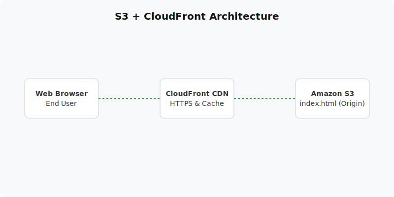

  

  # Static Website on S3 + CloudFront (Project 02)
  
  **Deploy a static portfolio globally using Amazon S3 and Amazon CloudFront.**

---

## 📋 Project Overview
This project involves hosting a static website on Amazon S3 and delivering it securely via Amazon CloudFront. This setup acts as a low-cost, highly available, and globally distributed architecture for static assets.

- **Level:** 🟢 Beginner
- **Time to Complete:** 1-2 hours
- **Cost Estimate:** $0.00 (S3 and CloudFront are within Free Tier limits)

## 🏗️ Architecture Flow
1. **Amazon S3 (Origin):** Stores the static HTML/CSS/JS files and is configured for static website hosting.
2. **Amazon CloudFront (CDN):** Serves the files from 400+ edge locations globally, enforcing HTTPS.
3. **End User:** Requests the domain, hits the CloudFront Edge Location (cached), which falls back to S3 if not cached.

## 📚 Documentation
For a deep dive into the components and steps, please refer to the documents below:

- 📄 [Project Overview](docs/project-overview.md)
- 🏗️ [Architecture Details](docs/architecture.md)
- 🚀 [Deployment Guide](docs/deployment-guide.md)
- 🔐 [Security Protocols](docs/security-protocols.md)
- 🧪 [Testing Procedures](docs/testing-procedures.md)
- 🛠️ [Troubleshooting](docs/troubleshooting.md)
- 🧹 [Cleanup Guide](docs/cleanup-guide.md)

## 💻 Automation Scripts
This project contains ready-to-run automation scripts for both **PowerShell** and **Bash**.
- **Windows:** `scripts/powershell/`
- **Linux/Mac:** `scripts/bash/`

## 🎓 Learning Objectives
1. Host and configure static web assets on Amazon S3.
2. Set up Amazon CloudFront for content delivery network (CDN) capabilities.
3. Enforce HTTPS natively using CloudFront.
4. Perform cache invalidations to update website content.

---
*Generated as part of the AWS Hands-On Portfolio.*
