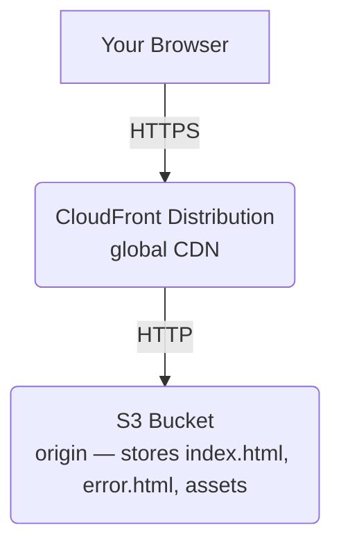

# Architecture Details

## Diagram

## Flow Overview
1. **User Request**: The user's browser requests the website content via the CloudFront URL over HTTPS.
2. **CloudFront CDN**: CloudFront receives the request. If the content is cached at an edge location near the user, it serves it immediately (Cache Hit). If not (Cache Miss), it fetches it from the origin.
3. **S3 Origin**: The S3 bucket configured for static website hosting serves as the origin. It stores the frontend files (HTML, CSS, JS) and returns them to CloudFront via HTTP.

## Components
- **S3**: Stores your HTML/CSS/JS files and serves them as a website. It is configured to allow public read access via a bucket policy and static website hosting is enabled with index/error documents configured.
- **CloudFront**: Caches your site at 400+ edge locations globally. It reduces latency by serving content closer to users and provides HTTPS for a secure connection to your static site.