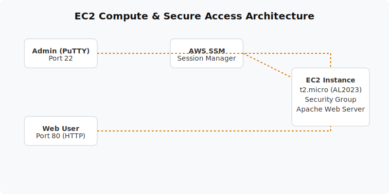

  

  # Launch EC2 & Connect via SSH (Project 03)
  
  **Deploy a virtual Linux server, configure network security, and host a live Apache web server.**

---

## 📋 Project Overview
This project provisions an Amazon Linux 2023 EC2 instance inside a default VPC. It covers secure remote management using both traditional SSH (PuTTY) and the modern, secure AWS Systems Manager (SSM) Session Manager. It also utilizes EC2 User Data to automatically bootstrap an Apache web server on launch.

- **Level:** 🟢 Beginner
- **Time to Complete:** 1-2 hours
- **Cost Estimate:** $0.00 (EC2 t2.micro is Free Tier eligible)

## 🏗️ Architecture Flow
1. **EC2 Instance:** A t2.micro running Amazon Linux 2023.
2. **Security Group:** Acts as a firewall allowing inbound HTTP (80) and SSH (22) from specific IP addresses.
3. **IAM Instance Profile:** Grants the EC2 instance permission to communicate with AWS Systems Manager.
4. **Access Methods:**
   - PuTTY via Port 22 (requires private key).
   - SSM Session Manager (browser/CLI based, no open inbound ports required).

## 📚 Documentation
For a deep dive into the components and steps, please refer to the documents below:

- 📄 [Project Overview](docs/project-overview.md)
- 🏗️ [Architecture Details](docs/architecture.md)
- 🚀 [Deployment Guide](docs/deployment-guide.md)
- 🔐 [Security Protocols](docs/security-protocols.md)
- 🧪 [Testing Procedures](docs/testing-procedures.md)
- 🛠️ [Troubleshooting](docs/troubleshooting.md)
- 🧹 [Cleanup Guide](docs/cleanup-guide.md)

## 💻 Automation Scripts
This project contains ready-to-run automation scripts for both **PowerShell** and **Bash**.
- **Windows:** `scripts/powershell/`
- **Linux/Mac:** `scripts/bash/`

## 🎓 Learning Objectives
1. Launch and configure an Amazon EC2 instance.
2. Secure instances using Key Pairs and Security Groups.
3. Automate software installation on boot using EC2 User Data.
4. Establish secure remote shell access using AWS Systems Manager without exposing port 22.

---
*Generated as part of the AWS Hands-On Portfolio.*