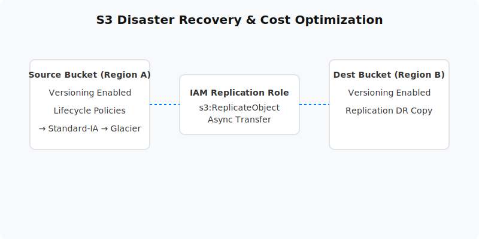

  

  # S3 Versioning, Lifecycle Policies & CRR (Project 04)
  
  **Implement robust data protection, disaster recovery, and automated cost optimization for S3.**

---

## 📋 Project Overview
This project demonstrates how to protect and manage objects in Amazon S3 like a professional. It covers enabling versioning to recover from accidental deletions, using Cross-Region Replication (CRR) for disaster recovery, and implementing Lifecycle Policies to automatically transition aging data to cheaper storage classes (like Glacier).

- **Level:** 🟢 Beginner
- **Time to Complete:** 1-2 hours
- **Cost Estimate:** ~$0.00 (Standard Free Tier applies)

## 🏗️ Architecture Flow
1. **Source Bucket (`ap-south-1`):** Enabled for versioning and contains the active objects.
2. **Lifecycle Policies:** Automates the transition of data from Standard → Standard-IA (Day 30) → Glacier (Day 90) → Expiration (Day 365).
3. **IAM Replication Role:** Grants S3 permission to securely replicate objects.
4. **Destination Bucket (`ap-south-2`):** Automatically receives copies of all new objects from the source for DR purposes.

## 📚 Documentation
- 📄 [Project Overview](docs/project-overview.md)
- 🏗️ [Architecture Details](docs/architecture.md)
- 🚀 [Deployment Guide](docs/deployment-guide.md)
- 🔐 [Security Protocols](docs/security-protocols.md)
- 🧪 [Testing Procedures](docs/testing-procedures.md)
- 🛠️ [Troubleshooting](docs/troubleshooting.md)
- 🧹 [Cleanup Guide](docs/cleanup-guide.md)

## 💻 Automation Scripts
This project contains ready-to-run automation scripts for both **PowerShell** and **Bash**.
- **Windows:** `scripts/powershell/`
- **Linux/Mac:** `scripts/bash/`

---
*Generated as part of the AWS Hands-On Portfolio.*