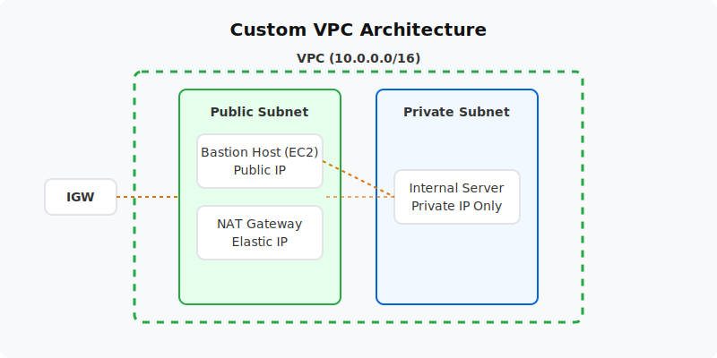

  

  # Custom VPC Foundation (Project 05)
  
  **Design and deploy a production-ready Virtual Private Cloud from scratch.**

---

## 📋 Project Overview
This project builds the networking foundation required by almost all AWS architectures. You will deploy a custom VPC with public and private subnets across two Availability Zones, an Internet Gateway for public access, and a NAT Gateway to allow private instances to securely download updates.

- **Level:** 🟡 Intermediate
- **Time to Complete:** 2-3 hours
- **Cost Estimate:** ~$0.05 (NAT Gateway incurs a small hourly charge)

## 🏗️ Architecture Flow
1. **Custom VPC (10.0.0.0/16):** The isolated network boundary.
2. **Public Subnets:** Contains the NAT Gateway and a Bastion Host (EC2). Routes to the Internet Gateway.
3. **Private Subnets:** Houses internal workloads. Routes outbound traffic to the NAT Gateway.
4. **Security Group Chaining:** Private EC2 instances only accept SSH traffic originating from the Bastion Host's security group.

## 📚 Documentation
- 📄 [Project Overview](docs/project-overview.md)
- 🏗️ [Architecture Details](docs/architecture.md)
- 🚀 [Deployment Guide](docs/deployment-guide.md)
- 🔐 [Security Protocols](docs/security-protocols.md)
- 🧪 [Testing Procedures](docs/testing-procedures.md)
- 🛠️ [Troubleshooting](docs/troubleshooting.md)
- 🧹 [Cleanup Guide](docs/cleanup-guide.md)

## 💻 Automation Scripts
This project contains ready-to-run automation scripts for both **PowerShell** and **Bash**.
- **Windows:** `scripts/powershell/`
- **Linux/Mac:** `scripts/bash/`

---
*Generated as part of the AWS Hands-On Portfolio.*