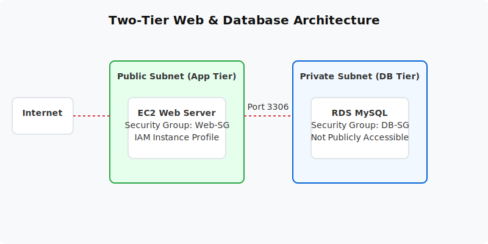

  

  # RDS MySQL + EC2 Two-Tier App (Project 06)
  
  **Deploy a secure two-tier application utilizing an EC2 web server and a private RDS database.**

---

## 📋 Project Overview
This project implements the classic web-tier and database-tier architecture. It deploys an Amazon EC2 instance in a public subnet running a web/app server, connected to a fully managed Amazon RDS MySQL database residing in a private subnet. Database credentials are appropriately stored in AWS Secrets Manager.

- **Level:** 🟡 Intermediate
- **Time to Complete:** 2-3 hours
- **Cost Estimate:** ~$0.05 (Secrets Manager pricing)

## 🏗️ Architecture Flow
1. **App Tier (EC2):** Resides in the public subnet, accepts HTTP traffic from the internet.
2. **Database Tier (RDS):** A MySQL instance in the private subnet with `PubliclyAccessible=false`. 
3. **Security:** The RDS Security Group strictly allows port 3306 inbound only from the EC2 Security Group ID.
4. **Secrets Manager:** The EC2 instance retrieves DB credentials dynamically using an IAM instance profile.

## 📚 Documentation
- 📄 [Project Overview](docs/project-overview.md)
- 🏗️ [Architecture Details](docs/architecture.md)
- 🚀 [Deployment Guide](docs/deployment-guide.md)
- 🔐 [Security Protocols](docs/security-protocols.md)
- 🧪 [Testing Procedures](docs/testing-procedures.md)
- 🛠️ [Troubleshooting](docs/troubleshooting.md)
- 🧹 [Cleanup Guide](docs/cleanup-guide.md)

## 💻 Automation Scripts
This project contains ready-to-run automation scripts for both **PowerShell** and **Bash**.
- **Windows:** `scripts/powershell/`
- **Linux/Mac:** `scripts/bash/`

---
*Generated as part of the AWS Hands-On Portfolio.*