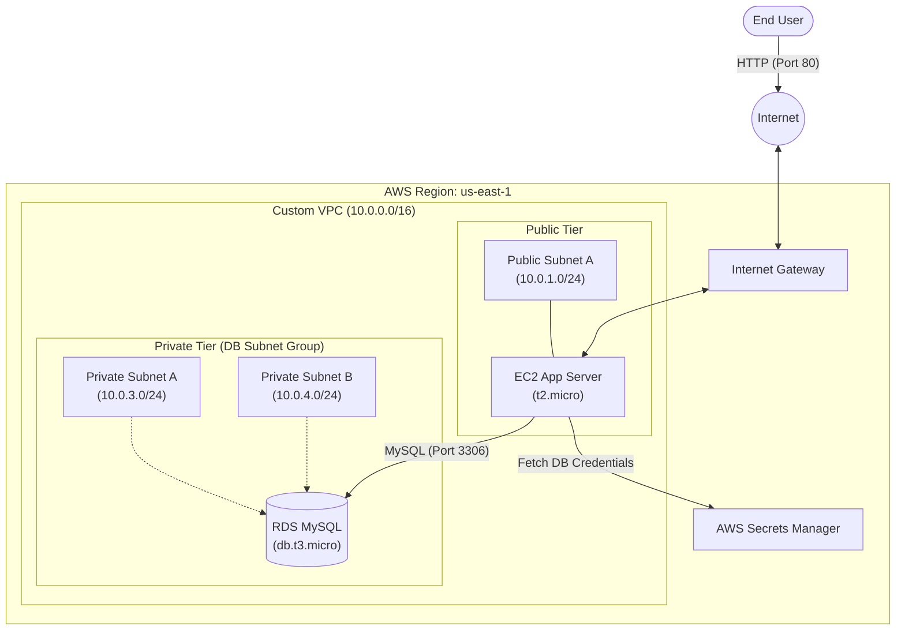

# Architecture Details

This document details the topology and component interactions of our Two-Tier Application Architecture.

## 🏗️ System Overview & Data Flow

The environment builds upon a custom VPC, securely segregating the web application and the database. 

We utilize public subnets to host our EC2 web server, making it accessible from the internet. Conversely, we utilize private subnets across two Availability Zones to host our RDS MySQL database, completely isolating it from direct public access.

## 🧩 Core Components

### 1. Public Subnet & EC2 App Server
- **Public Subnet (`10.0.1.0/24`)**: Contains resources that must be reachable from the internet. It routes `0.0.0.0/0` traffic to the Internet Gateway.
- **EC2 App Server**: An Amazon Linux 2023 instance running our application code (or a simple MySQL client for testing). It is assigned a Public IP address so users can connect to it.

### 2. Private Subnets & RDS DB Instance
- **Private Subnets (`10.0.3.0/24`, `10.0.4.0/24`)**: Contain backend systems that should never be directly exposed. They have no route to an Internet Gateway.
- **DB Subnet Group**: A logical grouping of our private subnets across multiple AZs. RDS requires this to know where it is allowed to provision database instances and failover replicas.
- **RDS MySQL**: The managed relational database instance. It holds our application data. It is inherently protected by residing in the private subnet.

### 3. Security Groups (The Firewalls)
- **`ec2-app-sg`**: Allows inbound HTTP traffic from anywhere (`0.0.0.0/0`) and SSH from the administrator's specific IP.
- **`rds-sg`**: Allows inbound MySQL traffic (Port 3306) **only** if the source is `ec2-app-sg`. This is called Security Group Chaining.

### 4. AWS Secrets Manager
A secure storage service holding the database master username and password. Instead of embedding passwords in the EC2 instance's code or environment variables, the application queries Secrets Manager at runtime via an IAM role.

## 🚦 Traffic Flow Example

When a user interacts with the application:
1. The user's browser sends an HTTP request over the Internet.
2. The request enters the VPC via the **Internet Gateway** and hits the **EC2 App Server** in the Public Subnet.
3. The EC2 instance needs to read data. It first securely retrieves the database password from **AWS Secrets Manager**.
4. The EC2 instance opens a MySQL connection to the **RDS Endpoint**.
5. The connection is validated by `rds-sg` (because the traffic originates from `ec2-app-sg`) and routed into the **Private Subnet**.
6. The database returns the queried data to the EC2 instance, which formats it and returns it to the user.