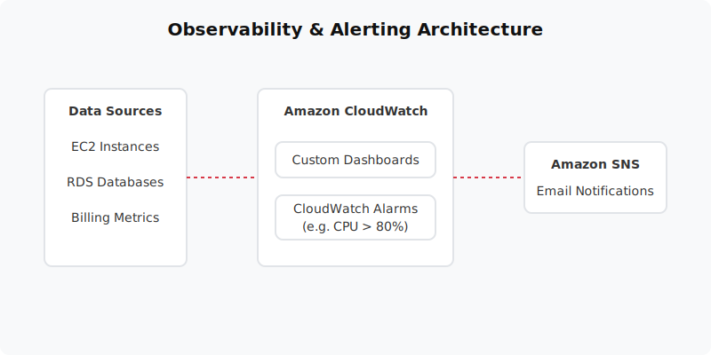

  

  # CloudWatch Monitoring & Alerts (Project 07)
  
  **Build a complete observability suite using Amazon CloudWatch and Amazon SNS.**

---

## 📋 Project Overview
This project establishes a comprehensive monitoring and alerting system. You will create custom CloudWatch Dashboards, configure Alarms for CPU/Billing/Storage thresholds, and use Simple Notification Service (SNS) to deliver real-time alerts via email when thresholds are breached. 

- **Level:** 🟡 Intermediate
- **Time to Complete:** 2 hours
- **Cost Estimate:** ~$0.00 (Mostly within Free Tier limits)

## 🏗️ Architecture Flow
1. **Compute & Data:** EC2 and RDS instances emit standard metrics (CPU, Storage, Network) to CloudWatch.
2. **CloudWatch Alarms:** Alarms monitor these metrics. If a metric breaches a threshold (e.g. CPU > 80% for 5 mins), the alarm enters the `ALARM` state.
3. **Amazon SNS:** The alarm triggers an SNS topic.
4. **Email Notification:** The SNS topic pushes the alert payload to all subscribed email addresses instantly.

## 📚 Documentation
- 📄 [Project Overview](docs/project-overview.md)
- 🏗️ [Architecture Details](docs/architecture.md)
- 🚀 [Deployment Guide](docs/deployment-guide.md)
- 🔐 [Security Protocols](docs/security-protocols.md)
- 🧪 [Testing Procedures](docs/testing-procedures.md)
- 🛠️ [Troubleshooting](docs/troubleshooting.md)
- 🧹 [Cleanup Guide](docs/cleanup-guide.md)

## 💻 Automation Scripts
This project contains ready-to-run automation scripts for both **PowerShell** and **Bash**.
- **Windows:** `scripts/powershell/`
- **Linux/Mac:** `scripts/bash/`

---
*Generated as part of the AWS Hands-On Portfolio.*