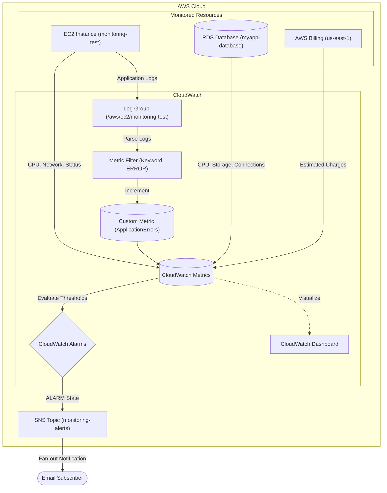

# Architecture Details: CloudWatch Monitoring & Alerts

## 🏗️ System Overview & Data Flow

This project implements a multi-tiered monitoring stack collecting metrics from compute resources, database resources, billing systems, and application logs.

## 🔄 Data Flow Analysis

1. **Metric Emission:** EC2 and RDS automatically emit standard metrics to CloudWatch every 1 to 5 minutes.
2. **Evaluation:** CloudWatch Alarms continuously evaluate incoming metric data against defined static thresholds (e.g., `> 70%` for 2 consecutive periods).
3. **Trigger:** If the threshold is breached, the alarm state transitions from `OK` to `ALARM`.
4. **Notification:** The alarm invokes the SNS Topic ARN configured in its actions.
5. **Delivery:** SNS fans out the message to all confirmed subscribers (Email).

## 🪵 Log Ingestion Workflow

1. Application logs are pushed to the CloudWatch Log Group `/aws/ec2/monitoring-test`.
2. A **Metric Filter** constantly scans incoming log streams for the specific keyword `ERROR`.
3. When matched, the filter increments a custom CloudWatch metric (`ApplicationErrors` in the `CustomMetrics` namespace).
4. A CloudWatch alarm monitors this custom metric and alerts if errors spike.

