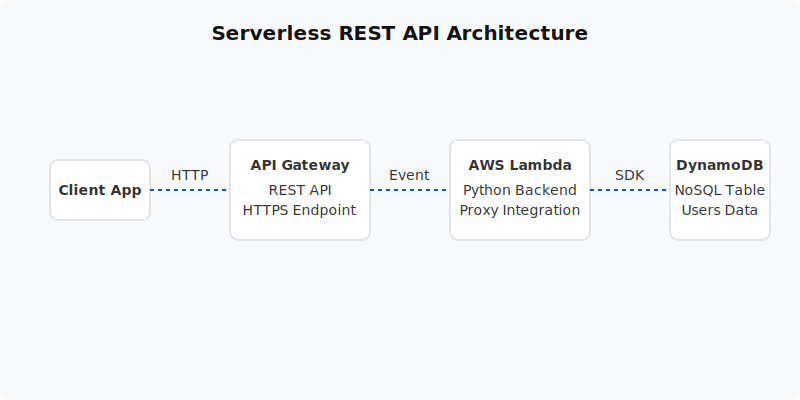

  

  # Serverless REST API (Project 08)
  
  **Deploy a fully scalable, serverless backend using API Gateway, Lambda, and DynamoDB.**

---

## 📋 Project Overview
This project builds a highly scalable REST API without managing a single server. Utilizing Amazon API Gateway to route HTTP requests, AWS Lambda to execute Python backend logic, and Amazon DynamoDB for NoSQL data storage, this architecture represents the modern standard for serverless applications.

- **Level:** 🟡 Intermediate
- **Time to Complete:** 2-3 hours
- **Cost Estimate:** $0.00 (All services permanently Free Tier eligible)

## 🏗️ Architecture Flow
1. **API Gateway:** Acts as the "front door", receiving HTTPS requests (GET, POST, PUT, DELETE).
2. **Lambda Proxy Integration:** API Gateway forwards the raw request to a Python Lambda function.
3. **AWS Lambda:** Executes business logic (e.g. validating input, processing data) and forms the JSON response.
4. **Amazon DynamoDB:** Lambda interacts with a serverless NoSQL table to store and retrieve user records.

## 📚 Documentation
- 📄 [Project Overview](docs/project-overview.md)
- 🏗️ [Architecture Details](docs/architecture.md)
- 🚀 [Deployment Guide](docs/deployment-guide.md)
- 🔐 [Security Protocols](docs/security-protocols.md)
- 🧪 [Testing Procedures](docs/testing-procedures.md)
- 🛠️ [Troubleshooting](docs/troubleshooting.md)
- 🧹 [Cleanup Guide](docs/cleanup-guide.md)

## 💻 Automation Scripts
This project contains ready-to-run automation scripts for both **PowerShell** and **Bash**.
- **Windows:** `scripts/powershell/`
- **Linux/Mac:** `scripts/bash/`

---
*Generated as part of the AWS Hands-On Portfolio.*