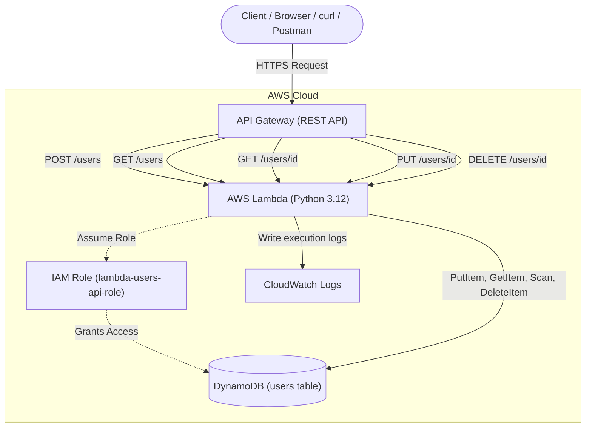

# Architecture Details: Serverless REST API

## 🏗️ System Overview & Data Flow

This project implements a fully serverless backend architecture utilizing Amazon API Gateway, AWS Lambda, and Amazon DynamoDB. The design pattern follows a standard synchronous REST API.

## 🔄 Data Flow Analysis

1. **Client Request:** The client makes an HTTPS request (e.g., `POST /users`) to the regional API Gateway endpoint.
2. **API Gateway Routing:** API Gateway routes the request to the backend integration. In this architecture, it uses **Lambda Proxy Integration**, passing the entire HTTP request payload (headers, path parameters, body, query strings) directly to the Lambda function as a JSON dictionary.
3. **Lambda Execution:** The `users-api` Lambda function is invoked. It parses the HTTP method (`event['httpMethod']`) and path to determine which internal function to call (e.g., `create_user()`).
4. **Database Transaction:** The Lambda function utilizes the `boto3` SDK to interact with DynamoDB. Its permissions to do this are strictly governed by its attached IAM execution role.
5. **Response Compilation:** DynamoDB returns the query results to Lambda. Lambda compiles this into a standard HTTP response dictionary containing a `statusCode`, `headers` (including CORS), and a JSON-encoded `body`.
6. **Return to Client:** API Gateway receives this dictionary, translates it back into a standard HTTP response, and sends it to the client.

## 🧩 Component Breakdown

### API Gateway (REST API)
Acts as the "front door" for the application. It provides:
- A stable, public-facing HTTPS endpoint
- Request routing based on resource paths (`/users`) and methods (`GET`, `POST`)
- Automatic CORS (Cross-Origin Resource Sharing) handling for browser clients
- Protection against DDoS attacks

### AWS Lambda
The compute layer where the Python business logic resides.
- Completely stateless; any data that must persist is saved to DynamoDB
- Automatically provisions concurrent execution environments if multiple requests arrive simultaneously
- Billed only for the exact milliseconds the code executes

### Amazon DynamoDB
A fully managed NoSQL database service providing single-digit millisecond latency.
- Uses the `userid` as the Partition Key (Primary Key)
- Schema-less design allows the user payload to contain arbitrary attributes alongside the required ID
- Provisioned capacity in the Free Tier (25 RCU / 25 WCU) easily handles development workloads

## 🔐 Security Architecture

1. **Internet to API Gateway:** Secured via TLS 1.2 (HTTPS). API Gateway manages the SSL certificates automatically.
2. **API Gateway to Lambda:** Secured via AWS internal IAM authorization. API Gateway is granted explicit permission to invoke the Lambda function via a Resource-Based Policy on the function.
3. **Lambda to DynamoDB:** Secured via an IAM Execution Role (Identity-Based Policy) attached to the Lambda function. The policy strictly follows least privilege, granting only specific actions (`PutItem`, `GetItem`, etc.) on the specific `users` table ARN.

## 📊 Performance & Cold Starts

Because Lambda scales down to zero, the very first request after a period of inactivity experiences a **Cold Start**.
1. **Cold Start (~500ms - 1s):** AWS must provision the container, load the Python runtime, and execute the initialization code outside the handler (e.g., `dynamodb = boto3.resource('dynamodb')`).
2. **Warm Start (~20ms - 50ms):** Subsequent requests hit the already-running container, skipping initialization and resulting in extremely fast responses.

> [!TIP]
> By initializing the `boto3` client outside the `lambda_handler` function, we ensure it only runs once per container lifecycle (during cold starts), significantly improving the performance of all subsequent warm invocations.