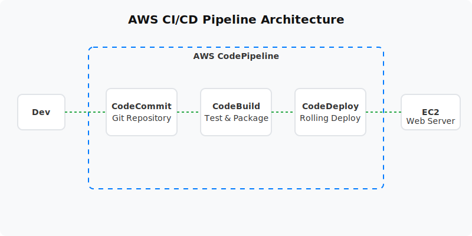

  

  # CI/CD Pipeline (Project 09)
  
  **Automate software delivery using CodeCommit, CodeBuild, CodeDeploy, and CodePipeline.**

---

## 📋 Project Overview
This project implements a fully automated Continuous Integration and Continuous Deployment (CI/CD) pipeline. It automates the process of fetching source code, validating/building artifacts, and deploying them to an EC2 instance, removing the need for manual server deployments.

- **Level:** 🟡 Intermediate
- **Time to Complete:** 2-3 hours
- **Cost Estimate:** ~$0.00 (Free Tier eligible)

## 🏗️ Architecture Flow
1. **CodeCommit (Source):** Developer pushes code to the `main` branch.
2. **CodePipeline (Orchestration):** Detects the push and triggers the pipeline.
3. **CodeBuild (Build):** Executes `buildspec.yml` to test code and package the artifact.
4. **CodeDeploy (Deploy):** Uses the `appspec.yml` to securely deploy the artifact to an EC2 instance, running necessary lifecycle scripts.

## 📚 Documentation
- 📄 [Project Overview](docs/project-overview.md)
- 🏗️ [Architecture Details](docs/architecture.md)
- 🚀 [Deployment Guide](docs/deployment-guide.md)
- 🔐 [Security Protocols](docs/security-protocols.md)
- 🧪 [Testing Procedures](docs/testing-procedures.md)
- 🛠️ [Troubleshooting](docs/troubleshooting.md)
- 🧹 [Cleanup Guide](docs/cleanup-guide.md)

## 💻 Automation Scripts
This project contains ready-to-run automation scripts for both **PowerShell** and **Bash**.
- **Windows:** `scripts/powershell/`
- **Linux/Mac:** `scripts/bash/`

---
*Generated as part of the AWS Hands-On Portfolio.*