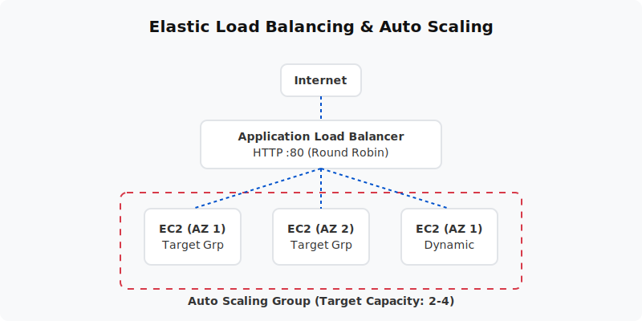

  

  # Auto Scaling Group & ALB (Project 10)
  
  **Design a self-healing, elastic web application architecture that automatically scales with demand.**

---

## 📋 Project Overview
This project builds the cornerstone of fault-tolerant cloud architecture. You will deploy an Application Load Balancer (ALB) to distribute traffic and an Auto Scaling Group (ASG) to automatically add or remove EC2 instances based on CPU utilization. If a server crashes, the ASG will automatically terminate it and launch a healthy replacement.

- **Level:** 🔴 Advanced
- **Time to Complete:** 2-3 hours
- **Cost Estimate:** ~$0.00 (Standard Free Tier applies)

## 🏗️ Architecture Flow
1. **Application Load Balancer:** Receives traffic from the internet on Port 80 and routes it to healthy instances in its Target Group.
2. **Auto Scaling Group:** Monitors the fleet. Desired capacity is set dynamically by scaling policies linked to CloudWatch CPU alarms.
3. **Launch Template:** The blueprint used by the ASG whenever it needs to spin up a new EC2 instance (specifies the AMI, Instance Type, Security Group, and Apache User Data).

## 📚 Documentation
- 📄 [Project Overview](docs/project-overview.md)
- 🏗️ [Architecture Details](docs/architecture.md)
- 🚀 [Deployment Guide](docs/deployment-guide.md)
- 🔐 [Security Protocols](docs/security-protocols.md)
- 🧪 [Testing Procedures](docs/testing-procedures.md)
- 🛠️ [Troubleshooting](docs/troubleshooting.md)
- 🧹 [Cleanup Guide](docs/cleanup-guide.md)

## 💻 Automation Scripts
This project contains ready-to-run automation scripts for both **PowerShell** and **Bash**.
- **Windows:** `scripts/powershell/`
- **Linux/Mac:** `scripts/bash/`

---
*Generated as part of the AWS Hands-On Portfolio.*
