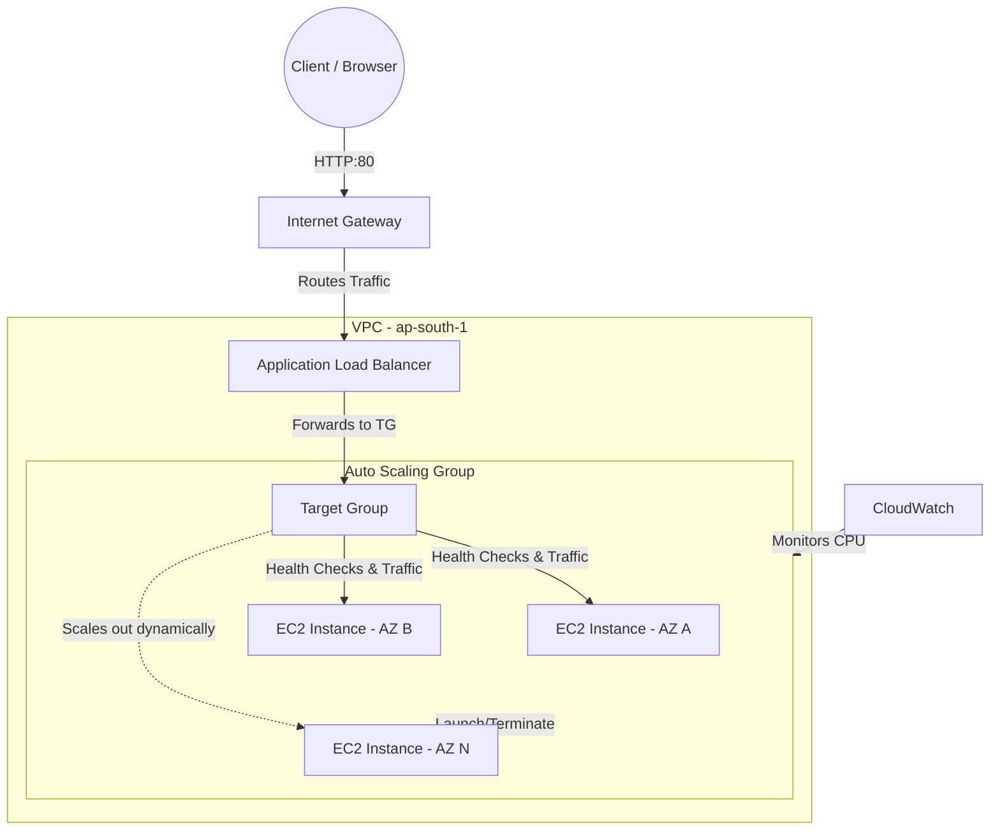

# Architecture Details: Auto Scaling & Load Balancing

## 🏗️ System Overview & Data Flow

The architecture of this project focuses on high availability (HA) and elasticity by decoupling the entry point from the compute layer and spreading resources across multiple Availability Zones (AZs).

## 🔄 Data Flow Analysis

1. **Client Request:** The user navigates to the ALB's DNS name in their browser (e.g., `my-alb-123.ap-south-1.elb.amazonaws.com`).
2. **DNS Resolution:** Route 53 (implicitly used by AWS) resolves the ALB DNS name to the public IP addresses of the ALB nodes distributed across the configured subnets.
3. **ALB Reception:** The ALB receives the request on its listener (Port 80).
4. **Target Evaluation:** The listener rules evaluate the request and forward it to the configured Target Group.
5. **Load Distribution:** The Target Group selects a healthy EC2 instance using a Round Robin algorithm and forwards the request to its private IP.
6. **Response:** The EC2 instance processes the request, serves the Apache web page, and sends the HTTP 200 OK response back through the ALB to the client.

## 🧩 Component Breakdown

### 1. VPC & Subnets
The infrastructure is deployed in the default VPC across at least two different Availability Zones (e.g., `ap-south-1a`, `ap-south-1b`). This ensures the application remains online even if an entire AWS datacenter experiences an outage.

### 2. EC2 Launch Template
The immutable blueprint used by the ASG. It specifies:
- **AMI:** Amazon Linux 2023
- **Instance Type:** `t2.micro`
- **Security Group:** `asg-ec2-sg`
- **User Data:** A base64-encoded shell script that installs Apache (`httpd`) and the `stress` utility at boot time, and writes an `index.html` file containing the instance's unique hostname.

### 3. Application Load Balancer (ALB)
Operates at Layer 7 (HTTP/HTTPS). It listens for traffic, terminates the incoming connection, and establishes a new connection to the target EC2 instance. It serves as a static entry point for clients, masking the fact that backend instances are constantly changing.

### 4. Target Group
A logical grouping of targets (EC2 instances). The Target Group is responsible for health checks. It periodically sends HTTP requests to the `/` path of every registered instance. If an instance fails consecutive checks, it is marked unhealthy and the ALB stops routing traffic to it.

### 5. Auto Scaling Group (ASG)
The control plane for the EC2 instances. It maintains:
- **Desired Capacity (2):** The number of instances it strives to keep running.
- **Minimum Capacity (2):** The absolute floor to ensure HA.
- **Maximum Capacity (6):** The ceiling to prevent runaway costs.
The ASG uses a **Target Tracking Scaling Policy** based on Average CPU Utilization (target: 50%) to add or remove instances dynamically.

## 🔐 Security Architecture

This architecture employs **Security Group Chaining**:
- `alb-sg`: Allows inbound HTTP traffic from `0.0.0.0/0` (the internet).
- `asg-ec2-sg`: Allows inbound HTTP traffic *only* from the `alb-sg` Security Group ID. It does not allow HTTP from `0.0.0.0/0`.
- **Result:** It is impossible for a user to bypass the load balancer and hit the EC2 instances directly. All traffic is forced through the ALB, which acts as a reverse proxy.

## 📊 Scalability & Scaling Mechanics

The ASG scaling policy operates as a feedback loop:
1. Instances report their CPU utilization to CloudWatch every 1-5 minutes.
2. CloudWatch calculates the aggregate average CPU across all instances in the ASG.
3. If the average exceeds 50% for the evaluation period, the CloudWatch Alarm triggers.
4. The ASG launches a new instance.
5. The ASG waits for the **Cooldown Period** (300 seconds) before evaluating whether another instance is needed, allowing the new instance time to boot and start taking load.