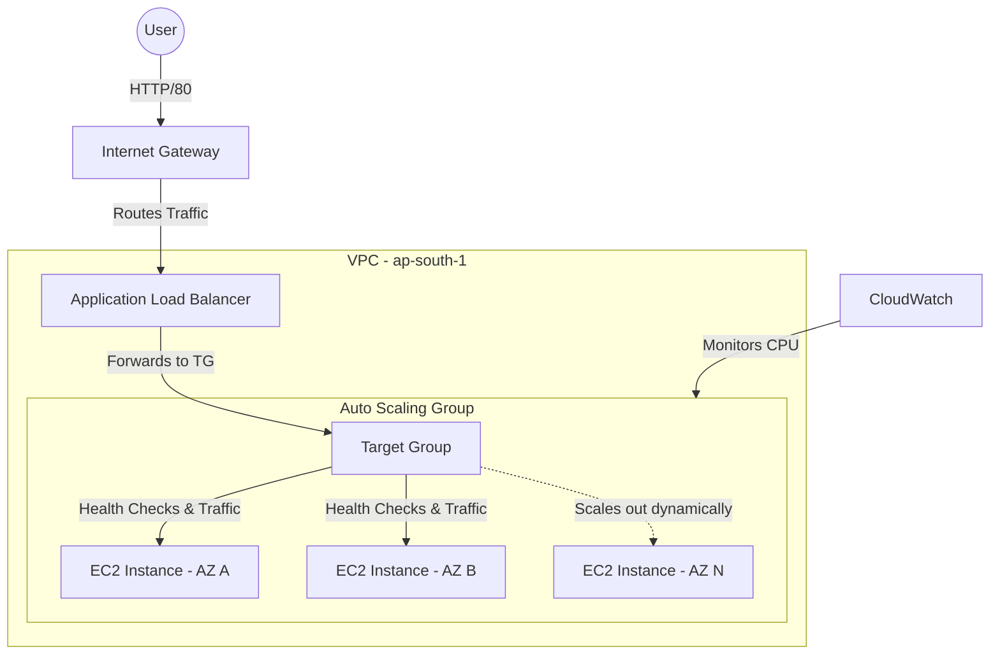

# Architecture Details

The architecture of this project focuses on high availability (HA) and elasticity by spreading resources across multiple Availability Zones (AZs).

## 🏗️ System Diagram

## 🧩 Components

1. **VPC & Subnets**: The infrastructure is deployed in the default VPC across two different Availability Zones to ensure tolerance against AZ failures.
2. **Security Groups**:
   - `alb-sg`: Allows inbound HTTP (80) traffic from anywhere (0.0.0.0/0).
   - `asg-ec2-sg`: Allows HTTP traffic *only* from the `alb-sg`, ensuring instances cannot be bypassed, plus SSH access from your specific IP.
3. **Launch Template**: Acts as the blueprint for the EC2 instances. It specifies the Amazon Linux 2023 AMI, `t2.micro` type, security groups, and a base64-encoded User Data script that installs Apache and a stress testing tool.
4. **Target Group**: Periodically sends HTTP requests to the `/` path of the instances. If an instance responds with a 200 OK, it is marked healthy.
5. **Application Load Balancer (ALB)**: Listens on port 80 and routes incoming internet traffic evenly to the healthy instances in the Target Group.
6. **Auto Scaling Group (ASG)**: Maintains a desired capacity of 2 instances. It uses a Target Tracking Scaling Policy based on Average CPU Utilization (target: 50%) to add or remove instances dynamically.