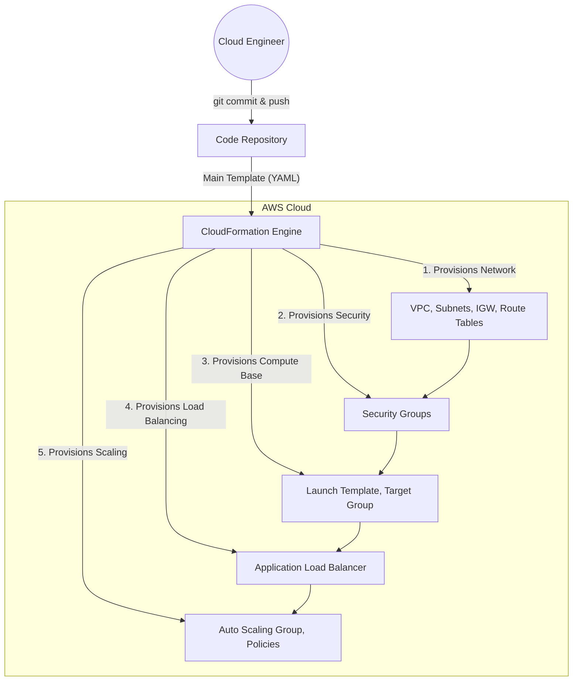

# Architecture Details: Infrastructure as Code

## 🏗️ System Overview & Provisioning Flow

Unlike previous projects where you clicked through the console, this architecture focuses on **how** the resources are provisioned. CloudFormation acts as the orchestrator, reading the declarative YAML template and executing the necessary API calls to AWS in the correct dependency order.

## 🔄 Dependency Management (The "State" Engine)

When you submit the template, CloudFormation builds a dependency graph. 

1. **Implicit Dependencies:** When you use the `!Ref` or `!GetAtt` intrinsic functions, CloudFormation automatically knows which resource must be built first. For example, because the Subnet resource references the VPC ID (`VpcId: !Ref VPC`), CloudFormation knows it must create the VPC before creating the Subnet.
2. **Explicit Dependencies:** Sometimes resources don't directly reference each other but still require an order of operations (e.g., a Route requires the Internet Gateway to be attached to the VPC). You define these using the `DependsOn` attribute.

## 🧩 Template Component Breakdown

The architecture is entirely defined by the sections of the `main-stack.yaml` template:

### 1. Parameters
Act as the "inputs" to your infrastructure code. They allow the same template to deploy drastically different environments (e.g., `dev` vs. `production`). 
- **Example:** The user inputs `InstanceType: t2.micro` and `EnvironmentType: dev`.

### 2. Mappings
Static lookup tables that allow the template to conditionally select values based on parameters. 
- **Example:** Looking up the correct AMI ID for Amazon Linux based on the region the stack is being deployed in, or determining how many instances to launch based on `EnvironmentType`.

### 3. Conditions
Boolean logic (`True` / `False`) that determines whether specific resources are created.
- **Example:** `IsProduction: !Equals [!Ref EnvironmentType, production]`. You can attach this condition to a Multi-AZ RDS instance, ensuring it is only created in prod, saving money in dev.

### 4. Resources
The core of the template. This defines the actual AWS components: the VPC, ALB, ASG, Launch Template, and Security Groups. This is where the physical architecture from Project 10 is translated into YAML.

### 5. Outputs
The "return values" of the stack. Outputs display critical information after deployment (like the ALB DNS URL) and can be exported for use by other CloudFormation stacks (cross-stack references).

## 🛡️ State & Drift

CloudFormation maintains the **state** of your deployment. It knows exactly which EC2 instance belongs to `my-app-stack`.

If someone manually logs into the AWS Console and modifies a Security Group port (bypassing the code), this introduces **Configuration Drift**. CloudFormation's **Drift Detection** feature compares the physical resources in AWS against the expected state defined in the YAML template, alerting you to manual, unapproved changes.
