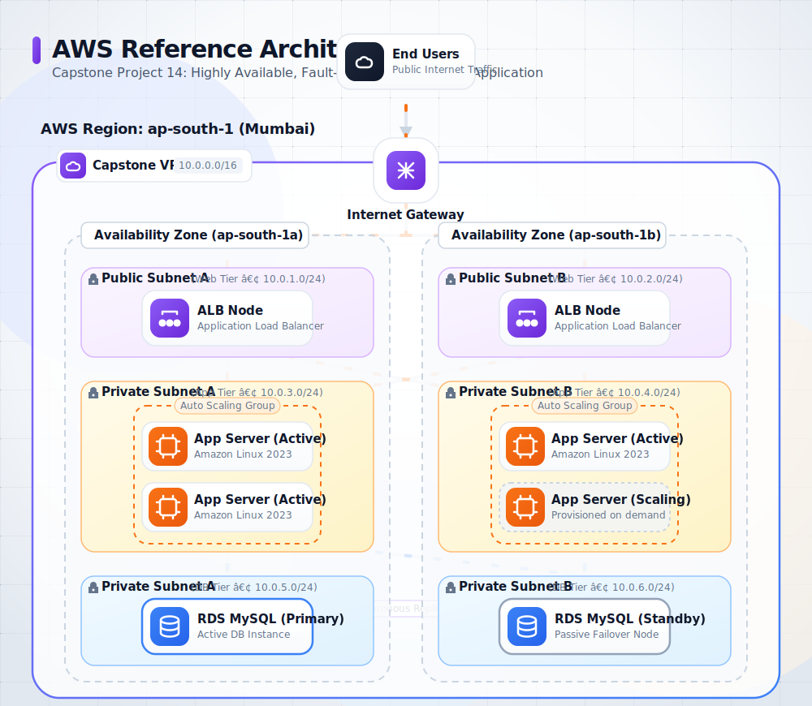

<div align="center">
  
  <h1>Project 14: Capstone Highly Available 3-Tier Architecture</h1>
  <p><em>A production-grade, fault-tolerant web application infrastructure on AWS.</em></p>

  [](#)
  [](#)
</div>

This capstone project brings together all fundamental AWS concepts into a single, cohesive, production-ready architecture. It proves your ability to build fault-tolerant, scalable, and secure applications on the cloud using industry best practices.

---

## 🏗️ Architecture Overview

The architecture utilizes a classic 3-Tier model (Web, Application, and Database) deployed across two Availability Zones for High Availability. 



---

## 📊 Infrastructure Specifications

| Specification | Value |
| :--- | :--- |
| **AWS Region** | `ap-south-1` (Mumbai) |
| **VPC CIDR** | `10.0.0.0/16` |
| **Subnets** | 6 (2 Public, 2 Private App, 2 Private DB) |
| **EC2 Instance Type** | `t2.micro` (Amazon Linux 2023) |
| **RDS Instance Type** | `db.t3.micro` (MySQL) |
| **High Availability** | True (ALB, ASG, RDS Multi-AZ) |

---

## 🧱 Key Components

### Networking & Routing
A custom Virtual Private Cloud (VPC) with an Internet Gateway for public access. A NAT Gateway is deployed in the public subnet to allow instances in the private subnets to securely download packages and updates from the internet.

### Compute & Load Balancing
An Application Load Balancer (ALB) handles incoming web traffic and routes it to an Auto Scaling Group (ASG) of EC2 instances residing in private subnets. The ASG dynamically scales the number of instances based on average CPU utilization.

### Data & Security
An Amazon RDS MySQL database in a Multi-AZ configuration ensures true high availability and synchronous data replication. AWS Secrets Manager is used to avoid hardcoding database credentials, dynamically injecting them into EC2 instances at boot time using IAM roles.

---

## ✨ Core Features

- **High Availability:** Spans two Availability Zones to survive localized hardware or data center failures.
- **Elastic Scalability:** Automatically scales compute resources in response to traffic spikes.
- **Deep Defense Security:** Employs strict Security Group chaining and private subnets. 
- **Automated Infrastructure:** Fully scriptable deployment via Bash, PowerShell, or CloudFormation.
- **Observability:** Custom CloudWatch Dashboards, Alarms, and SNS email notifications.

---

## 💰 Free Tier Status

> [!CAUTION]
> This architecture is **NOT** entirely covered by the AWS Free Tier. You will incur charges if you leave it running.

| Service | Free Tier Eligible | Estimated Cost / Hr |
| :--- | :--- | :--- |
| **EC2 t2.micro** | Yes (750 hrs/month) | ~$0.0116 |
| **ALB** | Yes (750 hrs/month) | ~$0.0225 |
| **RDS t3.micro** | Yes (Single-AZ only) | ~$0.034 (Multi-AZ) |
| **NAT Gateway** | **NO** | ~$0.045 + Data |
| **Secrets Manager** | Yes (30 day trial) | $0.40 per secret/month |

---

## 🛠️ Setup & Installation

### Prerequisites
- AWS CLI installed and configured (`aws configure`).
- Default region set to `ap-south-1`.
- Existing EC2 key pair named `aws-ec2-keypair`.

### Installation
Clone the repository and prepare your environment:
```bash
git clone https://github.com/vinaykumarduvva/aws-hands-on-projects.git
cd aws-hands-on-projects/project-14-capstone-3-tier
```

### Run Commands

Choose your platform and execute the deployment scripts in order:

| Step | Bash Script                           | PowerShell Script                            | Description                                            |
| :----:| :--------------------------------------| :---------------------------------------------| :-------------------------------------------------------|
| 00   | `scripts/bash/00-pre-flight.sh`       | `scripts/powershell/00-pre-flight.ps1`       | Execute pre-flight checks (Account, Region, Keypair)   |
| 01   | `scripts/bash/01-build-network.sh`    | `scripts/powershell/01-build-network.ps1`    | Execute VPC, Subnets, IGW, and NAT Gateway creation    |
| 02   | `scripts/bash/02-security-groups.sh`  | `scripts/powershell/02-security-groups.ps1`  | Execute Security Group chaining (ALB -> App -> DB)     |
| 03   | `scripts/bash/03-database-tier.sh`    | `scripts/powershell/03-database-tier.ps1`    | Execute RDS Multi-AZ database provisioning             |
| 04   | `scripts/bash/04-application-tier.sh` | `scripts/powershell/04-application-tier.ps1` | Execute IAM Roles and EC2 Launch Template creation     |
| 05   | `scripts/bash/05-web-tier.sh`         | `scripts/powershell/05-web-tier.ps1`         | Execute Target Group and ALB provisioning              |
| 06   | `scripts/bash/06-auto-scaling.sh`     | `scripts/powershell/06-auto-scaling.ps1`     | Execute Auto Scaling Group and Scaling Policy setup    |
| 07   | `scripts/bash/07-monitoring.sh`       | `scripts/powershell/07-monitoring.ps1`       | Execute SNS, CloudWatch Alarms, and Dashboard creation |
| 08   | `scripts/bash/08-verify-stack.sh`     | `scripts/powershell/08-verify-stack.ps1`     | Execute final verification and output ALB URL          |
| 09   | `scripts/bash/09-failover-testing.sh` | `scripts/powershell/09-failover-testing.ps1` | Execute chaos engineering and failover testing         |
| 10   | `scripts/bash/10-cleanup.sh`          | `scripts/powershell/10-cleanup.ps1`          | Execute complete teardown of all resources             |

---
### 📸 Screenshots & Validation
Throughout the documentation and `images/` directory, you will find screenshots captured during the deployment process. These visual artifacts serve as verification that the UI steps were successfully executed and validate the final architecture.

## 📚 Documentation Suite

For deeper insights into the project, explore the comprehensive documentation:

| Document | Description |
| :--- | :--- |
| 📖 [Project Overview](./docs/project-overview.md) | Business problem, solution, and learning objectives. |
| 🏗️ [Architecture](./docs/architecture.md) | System diagram, data flow, and component breakdown. |
| 🛠️ [Deployment Guide](./docs/deployment-guide.md) | Step-by-step instructions for Console, Bash, and PowerShell. |
| 🔐 [Security Protocols](./docs/security-protocols.md) | IAM, network isolation, encryption, and compliance details. |
| 🧪 [Testing Procedures](./docs/testing-procedures.md) | Functional, Failover (Chaos Engineering), and Security tests. |
| 🔍 [Troubleshooting](./docs/troubleshooting.md) | Symptom/Cause/Fix guides and useful debugging commands. |
| 🧹 [Cleanup Guide](./docs/cleanup-guide.md) | **Critical:** Instructions to destroy resources and avoid charges. |

---

## 🤝 Contribution & Maintenance
- **Testing:** Please test all scripts in a sandbox account before running in production. Use the provided failover scripts to validate HA.
- **Contributing:** PRs are welcome. Please ensure any architectural changes are reflected in the SVG diagram and documentation.

## ⚖️ License
This project is licensed under the MIT License - see the [LICENSE](./LICENSE) file for details.

---

<div align="center">
  <b><a href="../project-13-event-driven-architecture/README.md">← Previous Project: Event Driven Architecture</a></b>
</div>
