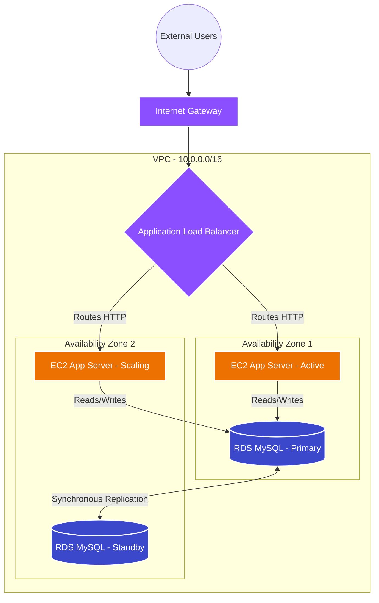

# Architecture Details: 3-Tier HA Architecture

This document details the architectural decisions, system components, and data flow of the Capstone Project.

## 🗺️ System Diagram

The architecture is also visually represented in a highly-detailed vector diagram:
`../architecture/capstone-architecture.svg`

*(Ensure you view the SVG in a modern browser to see the interactive hover states and data flow animations).*

## 🧱 Component Architecture

### 1. The Web Tier (Public Subnets)
The Web Tier acts as the entry point to the application. It resides in the public subnets (10.0.1.0/24 and 10.0.2.0/24).
- **Internet Gateway (IGW):** Attached to the VPC, providing a route to the internet for the public subnets.
- **Application Load Balancer (ALB):** Spans both public subnets. It continuously performs health checks (`/health.json`) on the application servers and routes incoming traffic only to healthy instances.
- **NAT Gateway:** Placed in Public Subnet A, it acts as a secure outbound proxy for instances in the private subnets.

### 2. The Application Tier (Private App Subnets)
The Application Tier contains the business logic. It is entirely isolated from the internet (10.0.3.0/24 and 10.0.4.0/24).
- **EC2 Auto Scaling Group (ASG):** Maintains a baseline of 2 instances (one per AZ). If average CPU utilization exceeds 60%, the ASG dynamically provisions up to 4 instances.
- **Launch Template:** Defines the golden image (Amazon Linux 2023), the IAM Instance Profile, and the User Data script. The User Data script automatically installs Apache, pulls DB credentials from Secrets Manager, and writes a dynamic web page that displays the instance's metadata and DB connection status.

### 3. The Database Tier (Private DB Subnets)
The Database Tier securely stores stateful data (10.0.5.0/24 and 10.0.6.0/24).
- **Amazon RDS for MySQL:** Deployed in a Multi-AZ configuration.
- **Synchronous Replication:** The primary database in AZ1 synchronously replicates all transactions to a standby database in AZ2.
- **Automatic Failover:** In the event of a primary failure, RDS automatically updates the DNS endpoint to point to the standby instance within 60-120 seconds, ensuring zero data loss and minimal downtime.

## 🔄 Data Flow Analysis

1. **Inbound Request:** A user makes an HTTP request. The request hits the Internet Gateway and is routed to the ALB in the public subnet.
2. **Load Balancing:** The ALB evaluates its routing rules and forwards the request to an EC2 instance in the private application subnet.
3. **App Processing:** The EC2 instance processes the request. If data is needed, it establishes a connection to the RDS primary endpoint on port 3306.
4. **Data Retrieval:** RDS processes the query and returns the data to the EC2 instance.
5. **Response:** The EC2 instance compiles the HTML response and sends it back through the ALB to the user.
6. **Outbound Traffic (Updates):** If the EC2 instance needs to download a yum package or communicate with the AWS API (e.g., Secrets Manager), the traffic routes through the NAT Gateway in the public subnet out to the internet.

## 🔒 Security Architecture (High-Level)
- **Deep Defense:** Security groups are chained. The internet can only talk to the ALB. The ALB can only talk to the App Tier. The App Tier can only talk to the DB Tier.
- **Private by Default:** 4 out of the 6 subnets are strictly private.
- **No Hardcoded Secrets:** Credentials are dynamically injected at boot time via AWS Secrets Manager.

*(For detailed security configurations, see `security-protocols.md`)*
